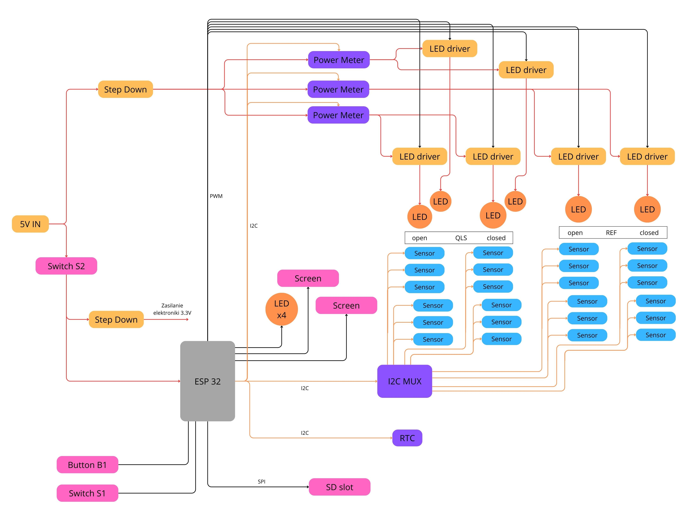

## Wysokopoziomowy schemat

## Kluczowe komponenty
- Mulitplexer i2c - TCA9548A
- Czujnik natężenia oświetlenia - TSL2561
- ESP32 z breakoutem
- Czujnik prądu - INA219
- Przetwornica - LM2596
- RTC - DS3231
- LEDy szerokie - https://pl.aliexpress.com/item/1917223733.html?spm=a2g0o.productlist.main.1.4203JmuZJmuZMx&algo_pvid=a4dea8f9-7ab4-40d6-bc7f-2d72c58d6c03&algo_exp_id=a4dea8f9-7ab4-40d6-bc7f-2d72c58d6c03-0&pdp_npi=4%40dis%21PLN%216.86%216.86%21%21%211.66%211.66%21%40211b801617066441220124958e03d2%2163448203856%21sea%21PL%21906899883%21&curPageLogUid=CnAPBGjU2nV0&utparam-url=scene%3Asearch%7Cquery_from%3A
- LEDy wąskie - zwykłe 5mm białe
- Wyświetlacz - oparty o driver TM1637
- Sterowniki LEDów - https://pl.aliexpress.com/item/1005006209373771.html?spm=a2g0o.productlist.main.21.7f40iEU8iEU8eH&algo_pvid=7586ae0e-1a44-4dfe-846a-5f522b743a87&algo_exp_id=7586ae0e-1a44-4dfe-846a-5f522b743a87-10&pdp_npi=4%40dis%21PLN%216.10%216.50%21%21%2110.59%2111.29%21%40211b80c217062966349318938e20d1%2112000036289296988%21sea%21PL%21906899883%21&curPageLogUid=pOPEMAXs0fS8&utparam-url=scene%3Asearch%7Cquery_from%3A

## Wgrywanie kodu
- Przed podłączeniem do komputera trzeba odpiąć zasilanie główne albo przełączyć S2 (wyłącznik elektroniki). Przełącznik ten służy do odłączenia całej elektroniki od zasilania głównego, pozostawiając tylko oświetlenie pod zasilaniem głównym. Pozwala to testować system będąc podłączonym do esp32 po USB.
- Projekt platformIO powinien działać od razu po pobraniu. Jedyne co trzeba zrobić, to wprowadzić dane WiFi do pliku src/server/secrets.h (najpierw trzeba go stworzyć na podstawie pliku src/server/secrets_template.h).

## Numeracja i adresowanie

Kolejność czujników oświetlenia w każdym z pomieszczeń:

    ______ ściana _____
    |                 |
    |   0         3   |
    |                 |
    |   1         4   |
    |                 |
    |   2         5   |
    |                 |
    ^^^^^^ okno ^^^^^^^

Kolejność pokoji w numeracji:
- 0 - QLS otwarty
- 1 - QLS zamknięty
- 2 - REF otwarty
- 3 - REF zamknięty

Kolejność czujników prądu:
- 0 - QLS     - pokoje 0, 1
- 1 - REF   - pokoje 2, 3
- 2 - QLS parroty

## Postprocesing
Wszystkie dane generowane przez stanowisko zapisywane są do pliku "Data.txt" na karcie SD. Dane są w formacie CSV z kolumnami oddzielonymi średnikami. Nagłówki kolumn znajdują się w pliku "Exel_header.xlsx" zamieszczonym w repo. 